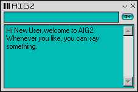



## AIG v2\.2\.5 \- True Artificial Intelligence

### Description

This is the latest version of AIG. This is version 2.2.5. This version has a skin, but the skin is very primative (it's still being worked on). The databases also still need work, the databases are almost like a language in their own (you can open the databases in a text editor). I'm still working on this so don't judge it as a finished product. There is no error checking yet so that also still needs to be implemented. All the code that is here was created by me only.

I would like some votes, but that isn't compulsary. ENJOY!
 
### More Info
 

             |
---                |---
**Submitted On**   |2002-11-05 11:44:14
**By**             |[Liquid\_Silver](https://github.com/Planet-Source-Code/PSCIndex/blob/master/ByAuthor/liquid-silver.md)
**Level**          |Intermediate
**User Rating**    |4.4 (35 globes from 8 users)
**Compatibility**  |VB 3\.0, VB 4\.0 \(16\-bit\), VB 4\.0 \(32\-bit\), VB 5\.0, VB 6\.0, VB Script, ASP \(Active Server Pages\) , VBA MS Access, VBA MS Excel
**Category**       |[Miscellaneous](https://github.com/Planet-Source-Code/PSCIndex/blob/master/ByCategory/miscellaneous__1-1.md)
**World**          |[Visual Basic](https://github.com/Planet-Source-Code/PSCIndex/blob/master/ByWorld/visual-basic.md)
**Archive File**   |[AIG\_v2\_2\_51524281520\.zip](https://github.com/Planet-Source-Code/liquid-silver-aig-v2-2-5-true-artificial-intelligence__1-42192/archive/master.zip)

